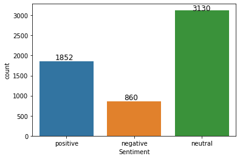
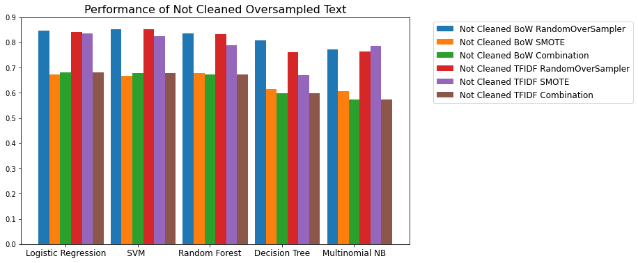
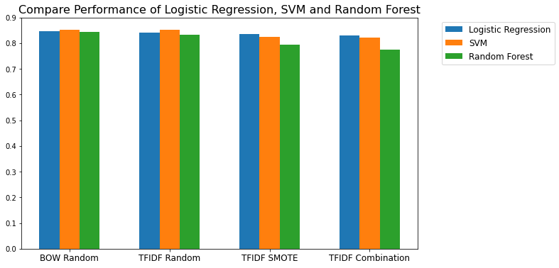
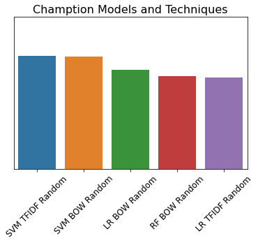
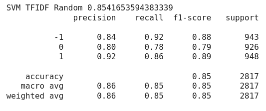
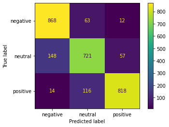

# Financial-Sentiment-Analysis and Financial Tweets

## Introduction
Sentiment Analysis is to identify and classify opinions and emotions expressed in texts using natural language processing and text analysis. Financial Sentiment Analysis is the analysis of financial news and information typically affecting the stock markets, and based on changes in sentiment, investors make investment decisions.

This study aims to perform sentiment analysis on the financial textual data available at Kaggle (https://www.kaggle.com/datasets/sbhatti/financial-sentiment-analysis). The dataset consists of financial sentences and sentiment labels including “neutral”, “positive” and “negative”.  There are approximately 5,800 rows, but the data is significantly imbalanced as the number of data for each class is very different as summarized below. 

 The motivation of this project is to explorer how to represent the text information, which machine learning algorithm works well, and how to handle the imbalance in data.  To deal with the imbalanced classifications, I used various over-sampling techniques along with the cost-sensitive learning.

## Methodology

### 1) Text Processing

The first step of the sentiment analysis is to clean the textual data by lowering the words and removing stop words and punctuation.  Stop words are words that frequently appear in the text and do not provide much information to the contex. Examples of stop words include "the", "what", "are" and they are often removed in the text analysis to focus more on the meaningful information and words. 

Next, the textual data must be converted into a numerical representation so the machine learning algorithms can be applied.  As Padurariu & Breaban (2019) mentioned that simple text representations such as Bag of Words and TF-IDF work better for small sets with large imbalance, I used Bag of Words and TF-IDF as text representation methods and compared the results between them. 

Lemmatization is to remove inflectional endings and to return the base or dictionary form of a word, which is often used to preprocess texts before text analysis. According to Heidenreich (2018), as lemmatization is designed with recall, precision tends to suffer as a result. Recall measures the number of positive class predictions made out of all positive class in the dataset whereas precision quantifies the number of positive class predictions that actually belong to the positive class. Since I am looking for the ability of a classification model to identify the relevant information, I need a good performance on both recall and precision, thus I have decided not to lemmatize in the preprocessing.

### 2) Model Selection

I applied the classification models by the following machine learning algorithms - Logistic Regression, Support Vector Machine, Decision Tree, Random Forest and Multinomial Naive Bayes, and compared the performance.  

### 3) Techniques to Handle Imbalanced Data

To deal with the imbalanced data, I have tried the following techniques.

a) Class weights in the models (cost-sensitive learning):

Cost-sensitive learning takes the costs of prediction errors into account when training a machine learning model. It is related to imbalanced learning to classify datasets with a skewed class distribution. The sklearn library provides examples of the cost-sensitive extensions via a parameter called the class_weight argument for most models. One of the class_weight options for sklearn is "balanced", which replicates the minority class until there are as many samples as in the majority class.

b) Oversampling using SMOTE:

Synthetic Minority Over-sampling technique (SMOTE) generates synthetic samples using the features of the data. The minority class is over-sampled by taking a minority class sample and then a line is drawn from this minority class sample to k-nearest minority class samples. SMOTE utilizes a k-nearest neighbor algorithm to create synthetic data. It first chooses random data from the minority class and then k-nearest neighbors from the data. Synthetic data is then made between the random data and the randomly selected k-nearest neighbor.

c) Oversampling using RandomOverSampler:

Random oversampling just randomly duplicates examples from the minority class and adds them to the training dataset. Therefore, it does not cause any increase in the variety of training examples. RandomOverSampler function in imblearn is used.

d) Combination of SMOTE with RandomUnderSampler:

In the original paper on SMOTE, Chawla, Bowyer, Hall and Kegelmeyer (2002) suggested that combining SMOTE with random under-sampling of the majority class. First, the minority classes are over-sampled to 2,800 (approximately 89.5% of examples of the majority class) each by SMOTE, then the majority class is under-sampled to agree with the number of the minority classes by random under-sampling using RandomUnderSampler function in imblearn. According to Chawla, Bowyer, Hall and Kegelmeyer (2002), by applying a combination of under-sampling and over-sampling, the initial bias of the leaner towards the majority class is reversed in the favor of the minority classes.

## Results

The performance was evaluated based on the weighted F1 scores on the validation set. As my data is imbalanced, the F1 score is the better metrics than the accuracy since the F1 score considers the type of errors made by model along with the number of prediction errors.

Support Vector Machine worked the best followed by Logistic Regression and Random Forest.  For all three models, RandomOverSampler resulted in higher F1 scores than SMOTE or combination of SMOTE and RandomUnderSampler to deal with my imbalance data.  TF-IDF generally worked better than Bag of Words as Bag of Words worked well only when randomly over-sampled.  

I have compared the performance with and without punctuation, but overall, removing
punctuation did not make much difference on the classification accuracy. But for my best
combination of the model and the techniques, data without removing punctuation worked slightly better. This is consistent with the result obtained by Sun (2018) as he concluded in his analysis that the preprocessing methods such as removing punctuation and lemmatizing do not have apparent influence on the classification accuracy. Rather, his result indicated that the raw texts work a little bit better than processed dataset, which is likely becacuse punctuation can keep certain sentiment.

The best combination for my data was Support Vector Machine with TF-IDF and RandomOverSampler. As shown on the classification report below, the weighted F1
score achieved was 0.85, which is a significant improvement by random over-sampling as the original F1 score with TF-IDF without over-sampling was 0.64.

## References:

[1] Sbhatti. (2022). "Financial Sentiment Analysis". Kaggle. https://www.kaggle.com/datasets/sbhatti/financial-sentiment-analysis

[2] Khanna, Chetna.  (2021).  "Text pre-processing: Stop words removal using different libraries".  Towards Data Science.

[3] Geron, Aurelien. (2019). "Hands-On Machine Learning with Scikit-Learn, Keras & TensorFlow".  O'Reilly.

[4] Chawla, Bowyer, Hall and Kegelmeyer.  (2002).  "SMOTE: Synthetic Minority Over-sampling Technique".  Journal of Artificial Intelligence Research.

[5] Padurariu, Cristian & Breaban, Mihaela Elena. (2019). "Dealing with Data Imbalance in Text Classification". Elsevier B.V.

[6] Heidenreich, Hunter. (2018). "Stemming? Lemmatization. What?". Towards Data Science.

[7] Brownlee, Jason.  (2020).  "SMOTE for Imbalanced Classification with Python".  Machine Learning Mastery.

[8] Brownlee, Jason.  (2021).  "Random Oversampling and Undersampling for Imbalanced Classification".  Machine Learning Mastery.

[9] Korstanje, Joos. (2021).  "The F1 score".  Towards Data Science.

[10] Vallantin, Lima. (2019).  "Why is removing stop words not always a good idea".  Medium.

[11] Sun, Richard.  (2018).  "Does punctuation matter in sentiment analysis?".  Voyager.